# Tasks: TST Tree Sorter

**Input**: Design documents from `/specs/001-tree-tab-sorter/`  
**Prerequisites**: plan.md, spec.md, research.md, data-model.md, contracts/messages.md  
**Last Updated**: Monday, February 10, 2026 (post-clarification Round 2)

**Tests**: Tests are MANDATORY per the project constitution. Every user story MUST include unit tests that fail before implementation.

**Organization**: Tasks are grouped by user story to enable independent implementation and testing of each story.

## Format: `[ID] [P?] [Story] Description`

- **[P]**: Can run in parallel (different files, no dependencies)
- **[Story]**: Which user story this task belongs to (e.g., US1, US2, US3)
- Include exact file paths in descriptions

## Phase 1: Setup (Shared Infrastructure)

**Purpose**: Project initialization and basic structure

- [x] T001 Create project structure per implementation plan: `src/background/`, `src/popup/`, `src/options/`, `src/lib/`, `src/icons/`, `tests/unit/`, `tests/integration/`
- [x] T002 Initialize npm project and install dependencies (`web-ext`, `mocha`, `chai`, `tldts`) in `package.json`
- [x] T003 [P] Configure ESLint and Prettier for ES2022 standards in `.eslintrc.json` and `.prettierrc`
- [x] T004 Create extension manifest with minimal permissions (`tabs`, `storage`, `menus`, `notifications`) and 4 keyboard shortcut commands (`sort-tree-title`, `sort-tree-url`, `sort-tree-domain`, `sort-tree-time`) in `manifest.json` (FR-019, FR-020)

---

## Phase 2: Foundational (Blocking Prerequisites)

**Purpose**: Core infrastructure that MUST be complete before ANY user story can be implemented

**⚠️ CRITICAL**: No user story work can begin until this phase is complete

- [x] T005 Implement storage service using `browser.storage.sync` (last-write-wins) for user settings in `src/lib/storage.js` — Settings entity: `confirmThreshold` (50), `disableConfirmation` (false), `toastDuration` (3000), `strictDomainSort` (false), `emptyDomainTop` (false), `disableGlobalConfirmation` (false) (FR-012)
- [x] T006 [P] Implement Tree Style Tab (TST) API wrapper for messaging (`get-tree`, `attach`, `scroll`) in `src/lib/tst-api.js` — Must handle TST not installed, version incompatibility, and permission errors per contracts/messages.md
- [x] T007 Implement locale-aware sorting utility using `Intl.Collator` (persistent instance) in `src/lib/sort-utils.js` — All sorts MUST be stable (FR-003)
- [x] T008 [P] Implement UI utility for toast notifications via `browser.notifications` API in `src/lib/ui-utils.js` — Success toast: 3s (configurable), error toast: 7s (hard-coded), both manually dismissable (FR-009)
- [x] T009 Create base settings popup UI and controller in `src/popup/popup.html` and `src/popup/popup.js` (FR-017)
- [x] T010 [P] Setup Mocha/Chai test runner and WebExtensions API mocks (`browser.tabs`, `browser.storage`, `browser.contextMenus`, `browser.runtime`) in `tests/test-setup.js`
- [x] T011 Implement selection clearing logic — clear all multi-selections after sort and ensure active tab remains focused (FR-021) in `src/background/controller.js`
- [x] T012 Implement scroll-to-active logic — use TST `scroll` API primary, fallback to `browser.tabs.update({active: true})` (FR-010) in `src/background/controller.js`
- [x] T013 Implement top-down deduplication and multi-selection targeting logic — query TST selection state, deduplicate overlapping parent/child selections (FR-002) in `src/background/controller.js`
- [x] T014 [P] Implement pinned tab filtering to exclude pinned tabs from all sort inputs (Edge Case: Pinned Tabs) in `src/background/controller.js` (`filterPinnedTabs`); unit test in `tests/unit/sort-pinned.test.js`
- [x] T015 [P] Implement persistent error notification via `browser.notifications` API for TST API failures with 7 second auto-dismiss (Edge Cases: TST Integration Failure, TST Version Incompatibility, Permission Denied) in `src/lib/ui-utils.js` and `src/background/controller.js` — "please update Tree Style Tab" message for version mismatch
- [x] T016 [P] Implement snapshot-based sorting to capture tab state at initiation, ensuring concurrent moves and new tabs are handled (Edge Cases: Concurrent Moves, New Tab Creation) in `src/background/controller.js`
- [x] T017 [P] Implement sort-in-progress mutex/guard to block re-entrant sort calls until the current sort completes (Edge Case: Concurrent Sort Operations) in `src/background/controller.js`
- [x] T018 [P] Implement zero-children guard check that shows "Nothing to sort" toast and returns early (Edge Cases: Empty Tree, Leaf Tab via Keyboard Shortcut) in `src/background/controller.js`
- [x] T019 [P] Implement partial sort failure handling — catch individual tab move errors, keep successfully sorted tabs, show partial-success warning toast (Edge Case: Partial Sort Failure) in `src/background/controller.js`
- [x] T020 [P] Add integration test verifying that sorting unloaded/discarded tabs does not trigger a reload (Edge Case: Unloaded Tabs) in `tests/integration/unloaded-tabs.test.js`

**Checkpoint**: Foundation ready — user story implementation can now begin

---

## Phase 3: User Story 1 — Sort Subtree by Title (Priority: P1) 🎯 MVP

**Goal**: Sort children of target tab alphabetically by title

**Independent Test**: Right-click tab with children → "Sort Tree" → "By Title" → "Ascending" → verify children are A-Z

### Tests for User Story 1

> **Write these tests FIRST, ensure they FAIL before implementation**

- [x] T021 [P] [US1] Implement unit tests for title sorting in `tests/unit/sort-title.test.js` (MUST FAIL FIRST) — Test cases:
  - Ascending A-Z sort
  - Descending Z-A sort
  - Case-insensitive comparison (`Alpha` vs `alpha`)
  - Locale-aware sorting (accented characters)
  - Stable sort for identical titles
  - TST Group Tab handling (sort by title like regular tabs)
  - Recursive vs immediate-only sorting

### Implementation for User Story 1

- [x] T022 [P] [US1] Implement hierarchical context menu registration for "By Title" in `src/background/menus.js` — Sub-menus: Sort Tree > By Title > {Ascending, Descending} × {Immediate Children, Entire Subtree}. Include always-visible "Sort All Top-Level" option (FR-001, FR-007, FR-008)
- [x] T023 [US1] Implement `sortTabsByTitle` logic (must support recursive traversal flag) in `src/lib/sort-logic.js` — Use `Intl.Collator` from `sort-utils.js`, stable sort (FR-003)
- [x] T024 [US1] Implement tab movement logic via TST `attach` API in `src/background/controller.js` — Must preserve parent-child relationships and maintain collapsed/expanded state (FR-005, FR-015)
- [x] T025 [US1] Integrate sort orchestration flow: snapshot → guard checks (mutex, empty tree, confirmation) → sort → move → toast → scroll → clear selection in `src/background/controller.js` (FR-009, FR-010, FR-021)

**Checkpoint**: User Story 1 (MVP) functional and testable independently. Verify: right-click parent tab → "Sort Tree" → "By Title" → "Ascending" → children reordered A-Z, toast appears, active tab scrolled into view.

---

## Phase 4: User Story 2 — Sort Subtree by URL (Priority: P1)

**Goal**: Sort children of target tab by full URL (Hostname > Path > Fragment)

**Independent Test**: Right-click tab with children → "Sort Tree" → "By URL" → "Ascending" → verify order

### Tests for User Story 2

- [x] T026 [P] [US2] Implement unit tests for URL sorting in `tests/unit/sort-url.test.js` (MUST FAIL FIRST) — Test cases:
  - Hostname-first ordering
  - Path ordering within same hostname
  - Credentials and query parameters included
  - Fragment (#section) included
  - Title as secondary sort key for ties
  - Stable sort for identical URLs

### Implementation for User Story 2

- [x] T027 [P] [US2] Add "By URL" options (including immediate vs recursive sub-menus) to context menu in `src/background/menus.js`
- [x] T028 [US2] Implement URL parsing and comparison logic (hostname > path including credentials, query params, fragments) in `src/lib/sort-utils.js` (FR-004)
- [x] T029 [US2] Implement `sortTabsByURL` logic (must support recursive traversal flag) with Title tie-breaking in `src/lib/sort-logic.js` (FR-004)

**Checkpoint**: User Stories 1 and 2 functional. Both sort criteria independently testable.

---

## Phase 5: User Story 3 — Sort Top-Level Tabs (Priority: P2)

**Goal**: Support sorting root-level tabs within the current window

**Independent Test**: Right-click any tab → "Sort All Top-Level" → "By Title" → verify all root tabs rearranged while children stay attached

### Tests for User Story 3

- [x] T030 [P] [US3] Implement unit tests for root-level identification and sorting in `tests/unit/sort-root.test.js` (MUST FAIL FIRST) — Test cases:
  - Root tab identification via TST API
  - Sub-trees remain attached after root sort
  - Window isolation (no cross-window movement)
  - Confirmation dialog triggers for Global Sort (counted by root-level tabs)
  - Internal subtree order preserved unless recursive

### Implementation for User Story 3

- [x] T031 [US3] Implement logic to identify root tabs in current window via TST API in `src/background/controller.js` (FR-006)
- [x] T032 [US3] Ensure sub-tree integrity is maintained during root sort — sub-trees MUST remain attached to parents, internal order preserved unless recursive (FR-006) in `src/background/controller.js`
- [x] T033 [US3] Implement window-isolation check to prevent cross-window movement in `src/background/controller.js` (FR-006)

**Checkpoint**: Global Sort works independently. Root tabs rearrange while sub-trees stay intact.

---

## Phase 6: User Story 4 — Sort by Domain & Last Accessed (Priority: P2)

**Goal**: Support sorting by PSL-based domain and recency (lastAccessed timestamp)

**Independent Test**: Right-click parent tab → "Sort Tree" → "By Domain" → "Ascending" → verify tabs grouped by base domain

### Tests for User Story 4

- [x] T034 [P] [US4] Implement unit tests for Domain and Time sorting in `tests/unit/sort-advanced.test.js` (MUST FAIL FIRST) — Test cases:
  - PSL-based domain extraction (`google.com` ≠ `google.co.uk`)
  - Strict sub-domain sorting toggle (`news.google.com` vs `maps.google.com`)
  - Non-HTTP(S) URLs treated as domainless (`about:`, `moz-extension://`, `data:`, `blob:`, `file:///`)
  - Domainless tabs grouped at bottom (default) or top (`emptyDomainTop` setting)
  - URL as secondary sort key for Domain ties
  - `lastAccessed` descending (newest first, default)
  - `lastAccessed` = 0 or undefined → treated as oldest, placed at bottom
  - Title as secondary sort key for Last Accessed ties
  - Stable sort for equal sort keys

### Implementation for User Story 4

- [x] T035 [P] [US4] Add "By Domain" and "By Last Accessed" options (including immediate vs recursive) to context menu in `src/background/menus.js`
- [x] T036 [US4] Implement Public Suffix List (PSL) parsing using `tldts` library (FR-013) in `src/lib/sort-utils.js` — Must include `strictDomainSort` toggle
- [x] T037 [US4] Implement `sortTabsByDomain` with strict/base toggle and recursion support in `src/lib/sort-logic.js` (FR-013)
- [x] T038 [US4] Implement `sortTabsByTime` using `lastAccessed` metadata and recursion support in `src/lib/sort-logic.js` — Handle `lastAccessed` = 0/undefined as epoch (FR-014)
- [x] T039 [US4] Add URL/Title tie-breaking for Domain/Time sorts in `src/lib/sort-logic.js`

**Checkpoint**: All 4 sort criteria functional. Domain grouping and recency sorting independently testable.

---

## Phase 7: Polish & Cross-Cutting Concerns

**Purpose**: Confirmation dialogs, keyboard shortcuts, state preservation, theming, settings UI

- [x] T040 Implement confirmation dialog via custom popup window (`src/background/confirm.html`, `src/background/confirm.js`) with themed dark/light styling and "Don't show again" checkbox, for >50 immediate children or Global Sort, checking storage for suppression preferences (`disableConfirmation`, `disableGlobalConfirmation`) (FR-011, FR-012) in `src/background/controller.js`
- [x] T041 [P] Implement full settings UI — confirmation thresholds, toast duration, empty domain position, strict domain sort toggle, `disableGlobalConfirmation` toggle — in `src/options/options.html` and `src/options/options.js` (FR-017)
- [x] T042 [P] Implement WebExtension command handlers for 4 keyboard shortcuts (`sort-tree-title`, `sort-tree-url`, `sort-tree-domain`, `sort-tree-time`) — ascending-only, immediate-children-only, "No children to sort" toast for leaf tabs (FR-019) in `src/background/shortcuts.js`
- [x] T043 Ensure tab audio/mute states (`audible`, `mutedInfo`) and collapsed/expanded states are preserved during reordering (FR-015, FR-016) in `src/background/controller.js`
- [x] T044 Implement Theme-Responsive UI — dynamic icon re-coloring using 3-tier preference (exact theme color, toolbar brightness, system preference) via `theme.onUpdated` API; standalone dark/light mode for toast, popup, and options page via `prefers-color-scheme` (FR-022) in `src/background/theme-handler.js` and UI HTML files

---

## Phase 8: Verification & Documentation

**Purpose**: Performance validation, final testing, documentation

- [x] T045 Perform final performance profiling with 1,000 tabs to verify <1s target (SC-002) in `tests/integration/performance.test.js`
- [x] T046 [P] Final documentation and README updates including `quickstart.md` validation
- [ ] T047 Run full quickstart.md smoke test (15 manual verification scenarios) and confirm all pass

---

## Dependencies & Execution Order

### Phase Dependencies

```mermaid
graph TD
    P1[Phase 1: Setup] --> P2[Phase 2: Foundational]
    P2 --> P3[Phase 3: US1 Title Sort 🎯 MVP]
    P2 --> P4[Phase 4: US2 URL Sort]
    P2 --> P5[Phase 5: US3 Global Sort]
    P2 --> P6[Phase 6: US4 Domain & Time]
    P3 --> P7[Phase 7: Polish]
    P4 --> P7
    P5 --> P7
    P6 --> P7
    P7 --> P8[Phase 8: Verification]
```

- **Setup (Phase 1)**: No dependencies — start immediately.
- **Foundational (Phase 2)**: Depends on Phase 1. **BLOCKS all user stories.**
- **User Stories (Phase 3–6)**: Depend on Phase 2. Can run in parallel or sequentially by priority (P1 → P2).
- **Polish (Phase 7)**: Depends on all user story phases (3–6).
- **Verification (Phase 8)**: Depends on Phase 7.

### Parallel Opportunities

- T003, T004 (Setup — independent files)
- T006, T008, T010, T014, T015, T016, T017, T018, T019, T020 (Foundational — independent features)
- T021, T022, T026, T027 (Tests and menu registrations — independent files)
- T034, T035 (US4 tests and menu — independent files)
- T041, T042, T044, T046 (Polish — independent files)

### Within Each User Story

1. Tests written FIRST → MUST FAIL before implementation
2. Menu registration (can parallel with tests)
3. Sort logic implementation
4. Controller integration
5. Checkpoint validation

---

## Implementation Strategy

### MVP First (User Story 1 Only)

1. Complete Phase 1 & 2.
2. Complete Phase 3 (Title Sort).
3. **STOP and VALIDATE**: Verify Title sort works without breaking tree hierarchy.
4. Success toast appears, active tab scrolled into view, parent-child intact.

### Incremental Delivery

1. Foundation → MVP (US1: Title Sort) → URL Sort (US2) → Global Sort (US3) → Domain & Time (US4) → Polish → Verification.

### Critical Path

`T001 → T005/T006/T007 → T023 → T024 → T025 → T040 → T045`

---

## Notes

- All UI text is hardcoded in English (FR-018).
- Permissions are strictly limited to necessary APIs: `tabs`, `storage`, `contextMenus` (FR-020).
- Multi-selections are cleared after every sort (FR-021).
- All error toasts auto-dismiss after exactly 7 seconds (hard-coded).
- All sort operations use stable sort algorithms (FR-003).
- Confirmation uses a custom popup window (`confirm.html`) with themed styling and "Don't show again" checkbox (FR-011).
- `browser.storage.sync` uses last-write-wins conflict resolution (FR-012).
- **CRITICAL**: Unit tests MUST be written before implementation logic for each story (Constitution Principle IV: TDD).